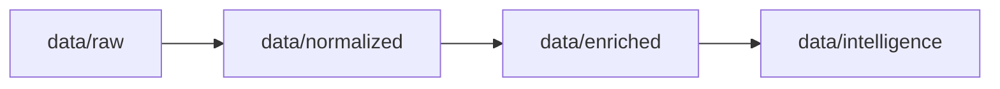

# 🕵️ Dark Web OSINT & Threat Intelligence Platform

A modular, Tor-native pipeline for dark web intelligence collection, enrichment, analysis, and confidence-based threat scoring.

---

## Overview

This project is an **end-to-end OSINT and Threat Intelligence platform** designed to monitor dark web ecosystems, extract actionable indicators, enrich them with external intelligence, and generate analyst-ready threat assessments.

It is built as a **layered intelligence pipeline**, not a collection of scripts.
Each stage has a clearly defined responsibility, strict data contracts, and explicit execution order controlled by a DAG-based pipeline engine.

The system is designed to scale from **local research** to **SOC-style automation** without architectural changes.

---

## What This Project Does

At a high level, the platform answers one question:

> *What activity on the dark web is actually relevant, and how risky is it?*

It does this through five distinct phases:

### 1. Collection

* Tor relay enumeration
* `.onion` service discovery
* Dark web marketplace scraping
* STIX/TAXII threat feed ingestion

### 2. Processing

* IOC extraction (IPs, domains, wallets, hashes)
* NLP-based named entity recognition
* Normalization of unstructured text into machine-readable data

### 3. Enrichment

* External intelligence correlation (VirusTotal, AbuseIPDB, Shodan, BGPView)
* Infrastructure and geolocation analysis
* Contextual metadata augmentation

### 4. Analysis

* Behavioral profiling
* Reputation estimation
* MITRE ATT&CK technique mapping
* Affiliate and RaaS structure detection
* Handle and alias correlation

### 5. Intelligence & Scoring

* Aggregation of multi-source signals
* Confidence-weighted threat scoring
* Generation of structured intelligence artifacts

---

## Architecture

The platform follows a **layered, unidirectional pipeline architecture**.
Each layer communicates only through explicit data artifacts and never mutates upstream data.

### Pipeline Flow

```mermaid
flowchart TD
    TOR[Tor Network]

    TOR --> COL[Collectors\n(Tor-facing)]

    COL -->|raw data| PROC[Processors\n(Extraction & Normalization)]

    PROC -->|normalized data| ENR[Enrichment\n(Context & Validation)]

    ENR -->|enriched evidence| ANL[Analysis\n(Reasoning & Profiling)]

    ANL -->|intelligence signals| SCORE[Intelligence Scoring]

    SCORE --> UI[Web Dashboard / CLI]
```

---

### Orchestration & Control Plane

Execution is coordinated by a **Python-native DAG engine**.
Pipeline order and parallelism are defined explicitly, not inferred from directory names or script order.

```mermaid
flowchart LR
    PIPE[Pipeline Engine\n(Async DAG)]
    REG[Stage Registry]
    STATE[State Manager]

    PIPE --> REG
    PIPE --> STATE

    REG --> STAGES[Pipeline Stages]
    STATE --> STAGES
```

---

### Networking & Safety Boundary

All dark web access is routed through a single, controlled interface.
No collector or scraper talks to the network directly.

```mermaid
flowchart TB
    FEAT[Collectors / Scrapers]
    TORCTL[Tor Manager\n(Circuit Isolation)]
    TORNET[Tor Network]

    FEAT --> TORCTL
    TORCTL --> TORNET
```

If Tor connectivity is lost, the pipeline fails closed.
There is no silent clearnet fallback.

---

### Data Lifecycle

Data flows forward only and is stored in clearly separated layers.



This design enables replayability, auditability, and partial re-execution.

---

## Project Structure

```
.
├── core/                  # Brain: Tor manager, pipeline engine, scoring
├── collectors/            # Tor-facing data collection
├── processors/            # IOC & entity extraction
├── enrichment/            # External intelligence correlation
├── analysis/              # Behavioral and threat analysis
├── orchestration/         # Pipeline entry points
├── data/                  # raw → normalized → enriched → intelligence
├── web/                   # Analyst dashboard
├── docs/                  # Project documentation
├── config/                # Runtime configuration
└── README.md
```

Execution order is defined by the pipeline DAG, not by directory structure.

---

## Installation

### Prerequisites

* Python **3.10+**
* A running **Tor daemon**

  * SOCKS proxy: `127.0.0.1:9050`
  * Control port: `127.0.0.1:9051`

### Setup

```bash
git clone https://github.com/AmanJ24/BlackSignal
cd BlackSignal

chmod +x setup.sh
./setup.sh
```

This script:

* creates a virtual environment
* installs dependencies
* prepares required NLP models

---

## Configuration

Sensitive values are stored in environment files.

```bash
cp .secrets.env.example .secrets.env
```

Add API keys as needed:

```env
VIRUSTOTAL_API_KEY=...
ABUSEIPDB_API_KEY=...
SHODAN_API_KEY=...
```

The pipeline runs without API keys, but enrichment depth will be reduced.

---

## Running the Pipeline

### Headless (CLI)

```bash
source venv/bin/activate
python orchestration/run_pipeline.py
```

Recommended for:

* cron jobs
* servers
* CI/CD environments

### Web Dashboard

```bash
source venv/bin/activate
python web/app.py
```

Open:

```
http://localhost:8080
```

The dashboard provides:

* pipeline execution control
* live logs
* intelligence visualization

---

## Security & OpSec Notes

* All dark web traffic is routed through Tor
* Circuit isolation is enforced per feature
* No direct network access from collectors
* No silent clearnet fallback
* Local-first data storage

If Tor fails, the pipeline halts.

---

## Disclaimer

**For educational and research purposes only.**

Accessing dark web services may be illegal in some jurisdictions.
You are responsible for ensuring compliance with all applicable laws.

The authors assume no liability for misuse.

---

## Contributing

Contributions are welcome, but must follow architectural rules:

1. All Tor access must go through the Tor Manager
2. Outputs must conform to defined schemas
3. Features must not hardcode execution order
4. Analysis modules must emit confidence-scored evidence

---

## Additional Documentation

- `docs/architecture.md`
- `docs/data_flow.md`
- `docs/pipeline_phases.md`
- `docs/threat_model.md`
- `docs/contributor_guide.md`

**Built to understand the dark web, not just scrape it.**
